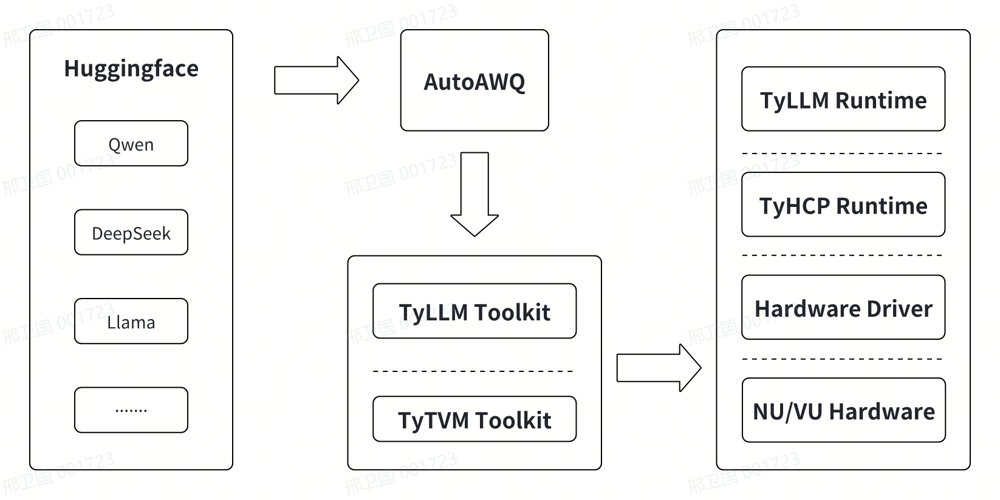

## 更新说明

本文记录了``Edge10``大模型工具链``TyLLM``的变更情况。

**20250305/v0.0.2**

- 🚀新增支持``Qwen2.5-VL-7B``模型``4Die/1Die``编译


## 整体介绍

``TyLLM``是云天励飞推出的大模型工具链，可帮助用户将大模型编译为``Edge10``系列芯片上执行的模型。除``TyLLM``还包括``AutoAWQ``和``TyTVM``，``AutoAWQ``为云天基于社区开源版本自行维护的量化模块，目的是最大化模型量化，在``Edge10``系列芯片上取得最佳性能；``TyLLM``为云天基于``TyTVM``工具链针对大模型增量开发的工具，主要基于``PyTorch``和``vLLM``对大模型做专属和定制优化；``TyTVM``为云天模型转换、量化、仿真、编译工具链，主要负责将模型编译为芯片执行的模型。

### 整体架构如图：

<div style="text-align:center;">
  
</div>

### 模型列表

已经支持的模型如下（包括不限于）：

| Model     | Support     |
| :-------- | :---------: |
| Qwen/Qwen2.5-VL-7B                            | ✅     |
| Qwen/Qwen2-VL-7B                              | ✅     |
| Qwen/Qwen2-7B                                 | ✅     |
| Qwen/Qwen1.5-1.8B                             | ✅     |
| deepseek-ai/DeepSeek-R1-Distill-Qwen-1.5B     | ✅     |
| deepseek-ai/DeepSeek-R1-Distill-Qwen-7B       | ✅     |
| deepseek-ai/DeepSeek-R1-Distill-Qwen-32B      | ✅     |
| Llama3-8B                                     | ✅     |


## 快速开始

本节介绍使用``TyLLM工``具链前的开发环境准备工作。``TyLLM``使用``Docker``容器进行工具链集成，用户可通过``Docker``加载``TyLLM``镜像文件，然后进行模型量化、编译、评估(未来)等工作，因此开发环境准备阶段需要正确安装``Docker``环境，同时目前需要量化阶段需要``GPU``来加速，以及多模态模型的编译依赖``vLLM``框架来推理，因此暂时需要``GPU``。

### 环境准备

- **Nvidia GPU**
- **Nvidia Container Toolkit**
- **Docker>19.03**

#### 安装Nvidia GPU 驱动

```shell
sudo apt install nvidia-driver-530 # 驱动版本尽量选择最高
# 安装完成后，执行nvidia-smi命令显示如下，表示安装成功。
+---------------------------------------------------------------------------------------+
| NVIDIA-SMI 535.179                Driver Version: 535.179      CUDA Version: 12.2     |
|-----------------------------------------+----------------------+----------------------+
| GPU  Name                 Persistence-M | Bus-Id        Disp.A | Volatile Uncorr. ECC |
| Fan  Temp   Perf          Pwr:Usage/Cap |         Memory-Usage | GPU-Util  Compute M. |
|                                         |                      |               MIG M. |
|=========================================+======================+======================|
|   0  NVIDIA GeForce RTX 3090        On  | 00000000:84:00.0 Off |                  N/A |
| 30%   27C    P8              23W / 350W |      3MiB / 24576MiB |      0%      Default |
|                                         |                      |                  N/A |
+-----------------------------------------+----------------------+----------------------+
                                                                                         
+---------------------------------------------------------------------------------------+
| Processes:                                                                            |
|  GPU   GI   CI        PID   Type   Process name                            GPU Memory |
|        ID   ID                                                             Usage      |
|=======================================================================================|
|  No running processes found                                                           |
+---------------------------------------------------------------------------------------+
```

#### 安装Docker

```shell
sudo apt install docker.io
sudo docker -v
# Docker version 20.10.21, build 20.10.21-0ubuntu1~20.04.2
```

#### 安装Nvidia Container Toolkit

添加包仓库和``GPG key``:
```shell
distribution=$(. /etc/os-release;echo $ID$VERSION_ID) \
    && curl -fsSL https://nvidia.github.io/libnvidia-container/gpgkey | sudo gpg --dearmor -o /usr/share/keyrings/nvidia-container-toolkit-keyring.gpg \
    && curl -s -L https://nvidia.github.io/libnvidia-container/$distribution/libnvidia-container.list | \
             sed 's#deb https://#deb [signed-by=/usr/share/keyrings/nvidia-container-toolkit-keyring.gpg] https://#g' | \
             sudo tee /etc/apt/sources.list.d/nvidia-container-toolkit.list
```

更新源，安装nvidia-container-toolkit

```shell
sudo apt update
sudo apt install nvidia-container-toolkit
```

#### 安装TyLLM工具链

以系统版本``Ubuntu 20.04``、工具链``tyllm_${version}.zip``为例说明``TyLLM``工具链的安装方法。实际操作时，请务必将``${version}``替换为实际对应的工具链版本号，比如``tyllm_v0.0.2.zip``

工具链获取途径

- 云天 docker hub

    ```shell
    sudo docker login 113.100.143.90:8091 -u custom -p DE@sz_intellif_2021
    sudo docker pull 113.100.143.90:8091/dengine/tyllm:v0.0.2
    ```

> **注意**，需要将``113.100.143.90:8091``加入``/etc/docker/daemon.json``中的``insecure-registries``字段中，如下：
> 
> ```json
> {     
>      "insecure-registries": ["113.100.143.90:8091"]
> }
>  ```
> 修改后，重启``docker``生效，``sudo systemctl restart docker``

#### 载入Docker Image

```shell
sudo docker load -i tyllm_v0.0.2.zip
# 载入成功后，查看镜像
sudo docker images
# 输出结果如下
REPOSITORY                              TAG     IMAGE ID       CREATED         SIZE
113.100.143.90:8091/dengine/tyllm       v0.0.2  a4a57c8af885   29 hours ago    10.4GB
```

#### 启动工具链镜像

以下命令创建容器，其中``${your_data_dir}``表示宿主机中用户数据目录。
```shell
docker run --gpus all -v ${your_data_dir}:/data -it 113.100.143.90:8091/dengine/tyllm:v0.0.2 bash
```

### 模型量化

云天的大模型量化是通过``AutoAWQ``工具完成，该工具是云天基于社区版本开发维护，其用法与社区版本基本一致，示例如下：

```python
from awq import AutoAWQForCausalLM
from transformers import AutoTokenizer

model_path = "Qwen/Qwen2.5-VL-7B-Instruct"
quant_path = "./Qwen2.5-VL-7B-Instruct-AWQ-INT4"

model = AutoAWQForCausalLM.from_pretrained(model_path, torch_dtype="float16", cache_dir="./")
tokenizer = AutoTokenizer.from_pretrained(model_path, trust_remote_code=True, cache_dir="./")

quant_config = {"zero_point": True, "q_group_size": 128, "w_bit": 4, "version": "GEMM", "lm_head_enable": True}
model.quantize(tokenizer, quant_config=quant_config)
model.save_quantized(quant_path)
tokenizer.save_pretrained(quant_path)
```

> **注意**
> - 其中，``zero_point``、``q_group_size``、``w_bit``、``version``一般固定为示例中的参数，仅``lm_head_enable``参数需要应情况调整，大多情况下为``True``，少部分模型可能会影响芯片上推理性能；
> - 加载原始模型的时候需要明确指定``torch_dtype="float16"``，因为默认是``"bfloat16"``，如果存在部分未量化的``module``，其``weight``仍然是``bfloat16``，云天芯片不支持；
> - 模型下载可能需要科学上网；
> - 也可使用社区版本进行量化，但需要移除``lm_head_enable``；


### 模型编译

本节主要介绍量化大模型的编译，目前分为语言大模型和视觉语言大模型，编译方式稍有不同，以下通过详细示例代码说明：

#### 语言大模型

以``Qwen1.5-1.8B``为例：

```python
from tyllm.build_util import build_and_compile_llm

quant_path = "./Qwen1.5-1.8B-AWQ-INT4"
aot_path = f"{quant_path}-AOT"

# 预填充序列长度
prefill_seq_len = 8
# 最大KV键值对数，控制模型推理期间上下文长度
max_kv_cache_size = 4096
# 指定多die编译，多die并行计算
die_num = 4
# 是否将embedding操作作为输入，默认False；如果True，embedding计算将被offload到cpu
embedding_as_input = False

build_and_compile_llm(
    model_path=quant_path,
    artifacts_path=f"{aot_path}/{die_num}die",
    max_kv_cache_size=max_kv_cache_size,
    seq_len_list=[1, prefill_seq_len],
    dev_count=die_num,
    embedding_as_input=embedding_as_input,
)
```

**参数说明**：

- **model_path(str)** ``huggingface``模型和配置文件的路径；
- **max_kv_cache_size(int, optional)** ``kv``缓存的最大容量，默认为``4096``；
- **seq_len_list(list of int, optional)** 用于构建和编译模型的序列长度列表，默认为``[1, 8]``；
- **dev_count(int, optional)** 用于运行已编译模型的设备数量（如 NNP 设备），默认为``1``；
- **artifacts_path(str, optional)** 保存模型编译产物（如权重、嵌入层等）的目录路径。如果未提供，将使用``model_path``作为默认路径；
- **embedding_as_input(bool, optional)** 如果为``True``，将提取嵌入层并单独保存为``NumPy``数组，默认为``False``；

**编译后产物目录**：

```shell
Qwen1.5-1.8B-AWQ-INT4
├── added_tokens.json
├── config.json
├── generation_config.json
├── merges.txt
├── model.safetensors
├── special_tokens_map.json
├── tokenizer.json
├── tokenizer_config.json
└── vocab.json
```

#### 视觉语言大模型

基于``vllm``的``Qwen2.5-VL``示例：

```python
import logging
import numpy as np
import torch
from PIL import Image
from vllm import LLM, SamplingParams
from vllm.config import ModelConfig
from tyllm.vllm_ext.edgex_executor import EdgeXExecutor
from tyllm import torch_edgex

os.environ["TOKENIZERS_PARALLELISM"] = "true"
logging.getLogger("vllm").setLevel(logging.WARNING)

model_dir = "./Qwen2.5-VL-7B-Instruct-AWQ-INT4"

# 指定多die编译，多die并行计算
num_die = 4
# 预填充序列长度
prefill_lens = 96
# 模型在单次推理中能够处理的最大序列长度（输入 + 输出的总 token 数量）。
max_model_len = 4096
# 模型视觉部分输入size
input_size = (540, 960, 3)  #(H, W, 3), (1080, 1920, 3), (720, 1280, 3), (540, 960, 3), (448, 768, 3)  (360, 640, 3)

torch_edgex.edgex_module.set_trace_only_mode(True)
torch_edgex.set_device_mode("exec_mode", "AOT")
torch_edgex.set_device_mode("prefill_lens", [1, prefill_lens])
# 设置输出目录
torch_edgex.set_device_mode("AOT_DIR", f"./Qwen2.5-VL-7B-Instruct-AWQ-INT4-AOT_{input_size[1]}x{input_size[0]}_{max_model_len}")
# 设置多die序列，其中首位表示die0表示主die
torch_edgex.set_device_mode("die_remap", [0, 1, 2, 3])

ModelConfig.verify_with_parallel_config = lambda a, b: True
torch._dynamo.reset()

def main():
    modality = "image"
    random_image = np.random.randint(0, 256, input_size, dtype=np.uint8)
    data = Image.fromarray(random_image)
    question = "请描述图片中的内容"

    llm = LLM(
        model=model_dir,
        max_model_len=max_model_len,
        tensor_parallel_size=num_die,  # die
        # 以下参数与硬件无关
        max_num_seqs=5,
        # Note - mm_processor_kwargs can also be passed to generate/chat calls
        mm_processor_kwargs={
            "min_pixels": 256 * 28 * 28,
            "max_pixels": 1280 * 28 * 28,
        },
        disable_mm_preprocessor_cache=True,
        trust_remote_code=True,
        disable_async_output_proc=True,
        distributed_executor_backend=EdgeXExecutor,
        worker_cls="tyllm.vllm_ext.edgex_executor.EdgeXWorker",
    )

    if modality == "image":
        placeholder = "<|image_pad|>"
    elif modality == "video":
        placeholder = "<|video_pad|>"

    prompt = (
        "<|im_start|>system\nYou are a helpful assistant.<|im_end|>\n"
        f"<|im_start|>user\n<|vision_start|>{placeholder}<|vision_end|>"
        f"{question}<|im_end|>\n"
        "<|im_start|>assistant\n"
    )

    # Single inference
    inputs = {
        "prompt": prompt,
        "multi_modal_data": {modality: data},
    }

    _ = llm.generate(inputs, use_tqdm=False)

if __name__ == "__main__":
    main()
```

编译后产物目录结构如下：

```shell
Qwen2.5-VL-7B-Instruct-AWQ-INT4-AOT_960x540_4096/
└── 4die
    ├── batch_1
    │   ├── common_die0.params
    │   ├── common_die1.params
    │   ├── common_die2.params
    │   ├── common_die3.params
    │   ├── seqlen_1
    │   │   ├── llm_die0.params
    │   │   ├── llm_die0.so
    │   │   ├── llm_die1.params
    │   │   ├── llm_die1.so
    │   │   ├── llm_die2.params
    │   │   ├── llm_die2.so
    │   │   ├── llm_die3.params
    │   │   └── llm_die3.so
    │   └── seqlen_96
    │       ├── llm_die0.params
    │       ├── llm_die0.so
    │       ├── llm_die1.params
    │       ├── llm_die1.so
    │       ├── llm_die2.params
    │       ├── llm_die2.so
    │       ├── llm_die3.params
    │       └── llm_die3.so
    ├── buffer_config.json
    ├── config.json
    ├── embedding.params
    ├── empty.bin
    ├── mrope
    │   ├── 3_4096_[int32].onnx
    │   └── 3_4096_[int32].so
    └── visual
        ├── 2584_1176_[float16].onnx
        ├── 2584_1176_[float16].so
        └── 2584_1176_[float16]_preset_kwargs.pt
```


## 常见问题

若在使用产品过程中遇到问题，可以参考此文档。

### 编译阶段出现segmentation fault(core dump)

**问题描述**：

编译过程中如果出现段错误，可能是pyarrow包版本问题

**解决方法**：

将``pyarrow``包降级至``16.0.0``，
```shell
pip install pyarrow==16.0.0
```

### <问题二>

若有必要，则在开头具体描述该问题，提供更多细节信息。

**问题描述**：

**解决方法**：


### <问题 N>

若有必要，则在开头具体描述该问题，提供更多细节信息。

**问题描述**：

**解决方法**：

